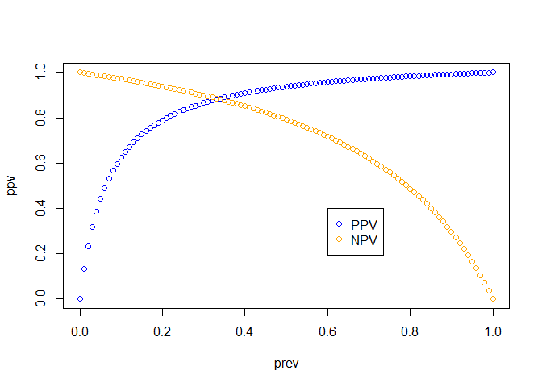

## A package for easy calculation of diagnostic test metrics with confidence intervals

## Installation

``` r
remotes::install_github("NicChr/epimetrics")
```

``` r
library(epimetrics)
```

You can easily calculate metrics from data, which is typically compared
to a gold standard

``` r
# Using a 2x2 confusion matrix example from wikipedia 
# https://en.wikipedia.org/wiki/Sensitivity_and_specificity
TP <- 20
FP <- 180
FN <- 10
TN <- 1820
CM <- matrix(c(TP, FP, FN, TN), byrow = TRUE, ncol = 2)
rownames(CM) <- c("+Test", "-Test")
colnames(CM) <- c("+Disease", "-Disease")
CM
#>       +Disease -Disease
#> +Test       20      180
#> -Test       10     1820
diagnostic_metrics(CM)
#>               characteristic abbreviation    estimate   conf.low   conf.high
#> 1                sensitivity          TPR  0.66666667 0.48780052  0.80769502
#> 2                specificity          TNR  0.91000000 0.89665917  0.92176885
#> 3                   accuracy          ACC  0.90640394 0.89295467  0.91831800
#> 4          balanced_accuracy          BAC  0.78833333 0.69865185  0.85909261
#> 5  positive_predictive_value          PPV  0.10000000 0.06567045  0.14940581
#> 6  negative_predictive_value          NPV  0.99453552 0.98997008  0.99702909
#> 7  positive_likelihood_ratio          PLR  7.40740741 5.54896809  9.88826817
#> 8  negative_likelihood_ratio          NLR  0.36630037 0.22078856  0.60771246
#> 9      diagnostic_odds_ratio          DOR 20.22222222 9.32219270 43.86717642
#> 10           true_prevalence          TPV  0.01477833 0.01037124  0.02101836
#> 11       apparent_prevalence          APV  0.09852217 0.08630637  0.11225456
#> 12      prevalence_threshold          PRT  0.26869764 0.24320128  0.30188803
#> 13              youden_index          YIX  0.57666667 0.39730369  0.71818522
#> 14 number_needed_to_diagnose          NND  1.73410405 1.39239846  2.51696630
```

0r from known or theoretical estimates of sensitivity, specificity and
prevalence

``` r
sens <- 0.75 # Sensitivity
spec <- 0.95 # Specificity
prev <- seq(0, 1, 0.01) # Prevalence
ppv <- ppv(sens, spec, prev)
npv <- npv(sens, spec, prev)
plot(prev, ppv, col = "blue")
points(prev, npv, col = "orange")
legend(0.6, 0.4, legend = c("PPV", "NPV"),
       col = c("blue", "orange"),
       pch = c(1, 1))
```

<!-- -->

You can also use standalone metrics

``` r
sensitivity(x = CM)
#>          estimate  conf.low conf.high
#> (20/30) 0.6666667 0.4878005  0.807695
specificity(x = CM)
#>             estimate  conf.low conf.high
#> (1820/2000)     0.91 0.8966592 0.9217688
ppv(x = CM, conf.level = 0.95)
#>          estimate   conf.low conf.high
#> (20/200)      0.1 0.06567045 0.1494058
```

Easily simulate confusion matrix data

``` r
simulated_data <- simulate_confusion_data(TP, FP, FN, TN, R = 10)
simulated_data
#>       TP  FP FN   TN
#>  [1,] 20 170 10 1830
#>  [2,] 19 180 11 1820
#>  [3,] 20 172 10 1828
#>  [4,] 17 185 13 1815
#>  [5,] 23 176  7 1824
#>  [6,] 19 195 11 1805
#>  [7,] 19 191 11 1809
#>  [8,] 19 176 11 1824
#>  [9,] 19 187 11 1813
#> [10,] 15 193 15 1807
ppv(x = simulated_data, conf.int = FALSE)
#>            estimate
#> (20/190) 0.10526316
#> (19/199) 0.09547739
#> (20/192) 0.10416667
#> (17/202) 0.08415842
#> (23/199) 0.11557789
#> (19/214) 0.08878505
#> (19/210) 0.09047619
#> (19/195) 0.09743590
#> (19/206) 0.09223301
#> (15/208) 0.07211538
ppv(x = simulated_data)
#>            estimate   conf.low conf.high
#> (20/190) 0.10526316 0.06918068 0.1569911
#> (19/199) 0.09547739 0.06197739 0.1442993
#> (20/192) 0.10416667 0.06844892 0.1554131
#> (17/202) 0.08415842 0.05320679 0.1306311
#> (23/199) 0.11557789 0.07826151 0.1674548
#> (19/214) 0.08878505 0.05757574 0.1344972
#> (19/210) 0.09047619 0.05868718 0.1369786
#> (19/195) 0.09743590 0.06326723 0.1471590
#> (19/206) 0.09223301 0.05984239 0.1395532
#> (15/208) 0.07211538 0.04418679 0.1155622
```

If your data are in non-aggregate form, you can use `confusion_matrix`

``` r
outcomes <- c(rep(1, TP + FN), # With disease
              rep(0, FP + TN)) # Without disease
predictions <- c(rep(1, TP), rep(0, FN), # Disease group predictions
                 rep(1, FP), rep(0, TN)) # Non-disease group predictions
(cm <- confusion_matrix(outcomes, predictions))
#>           outcome
#> prediction  1    0
#>          1 20  180
#>          0 10 1820
diagnostic_metrics(cm)
#>               characteristic abbreviation    estimate   conf.low   conf.high
#> 1                sensitivity          TPR  0.66666667 0.48780052  0.80769502
#> 2                specificity          TNR  0.91000000 0.89665917  0.92176885
#> 3                   accuracy          ACC  0.90640394 0.89295467  0.91831800
#> 4          balanced_accuracy          BAC  0.78833333 0.69865185  0.85909261
#> 5  positive_predictive_value          PPV  0.10000000 0.06567045  0.14940581
#> 6  negative_predictive_value          NPV  0.99453552 0.98997008  0.99702909
#> 7  positive_likelihood_ratio          PLR  7.40740741 5.54896809  9.88826817
#> 8  negative_likelihood_ratio          NLR  0.36630037 0.22078856  0.60771246
#> 9      diagnostic_odds_ratio          DOR 20.22222222 9.32219270 43.86717642
#> 10           true_prevalence          TPV  0.01477833 0.01037124  0.02101836
#> 11       apparent_prevalence          APV  0.09852217 0.08630637  0.11225456
#> 12      prevalence_threshold          PRT  0.26869764 0.24320128  0.30188803
#> 13              youden_index          YIX  0.57666667 0.39730369  0.71818522
#> 14 number_needed_to_diagnose          NND  1.73410405 1.39239846  2.51696630
```
